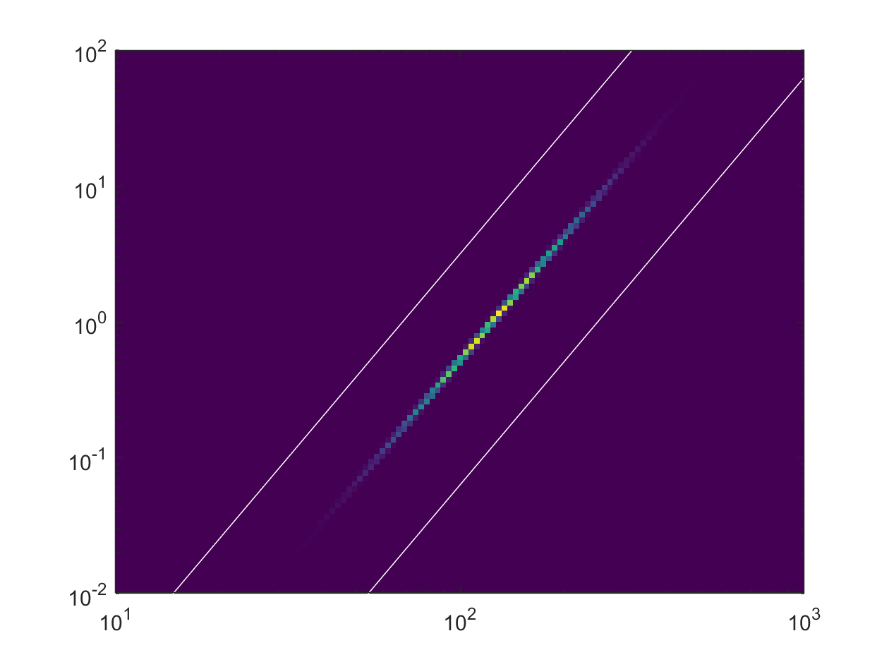
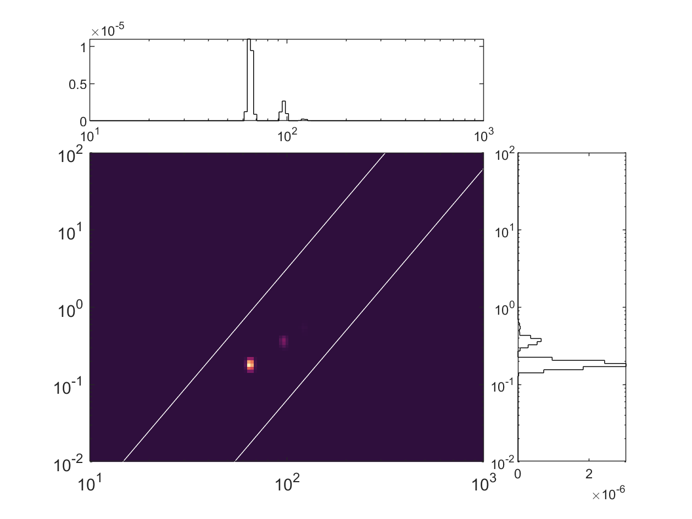
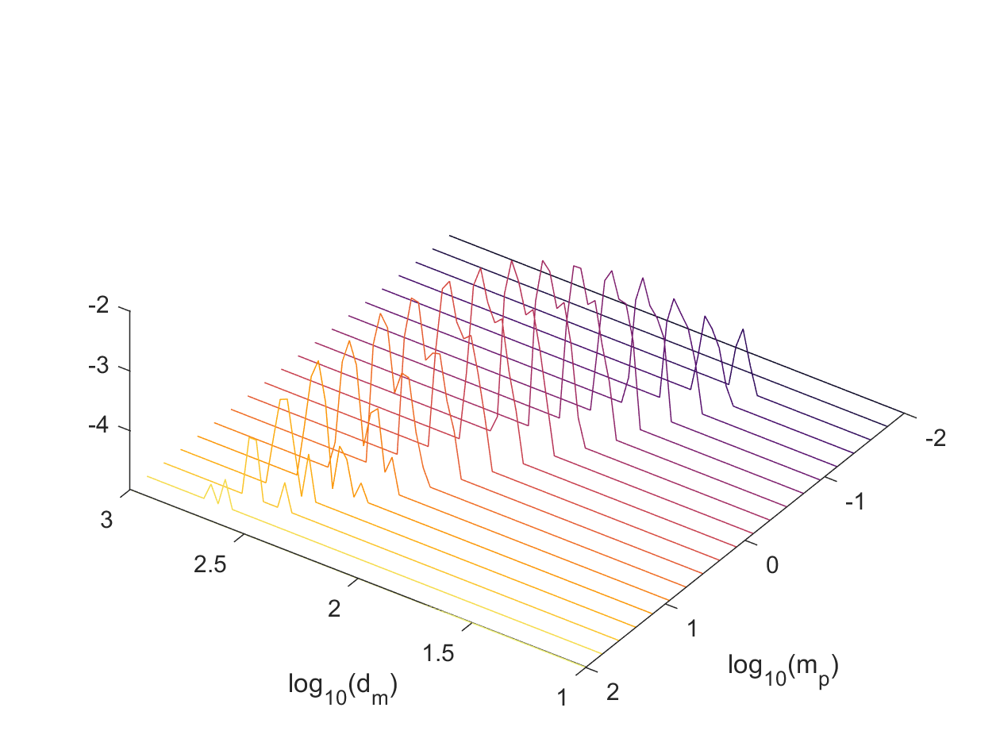
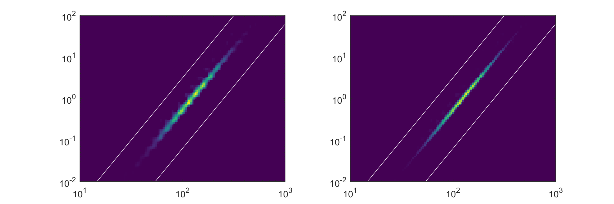

# BIDIAS

(**Bid**imensional **I**nversion of **A**erosol distributions)

(Previously mat-2d-aerosol-inversion)

[](10.17632/sg2zj5yrvr.3)
[](https://lbesson.mit-license.org/)
[]()

This program, originally released with [Sipkens et al. (2020a)][1_JAS1], is designed to invert tandem measurements of aerosol size distributions. Initially, this code was developed for inversion of particle mass analyzer-differential mobility analyzer (PMA-DMA) data to find the two-dimensional mass-mobility distribution. However, the code has since been generalized to other applications, e.g., the inversion of PMA-SP2 data as in Naseri et al. ([2021][naseri21], [2022][naseri22]). 

## Table of contents

[Setup](#setup)

[Getting started: A sample inversion](#getting-started-a-sample-inversion)

[1. UNDERLYING PHYSICS](#1-underlying-physics)

[2. UPPER DIRECTORY SCRIPTS](#2-upper-directory-scripts)

[3. CLASSES](#3-classes)

- [3.1 Grid class](#31-grid-class)

- [3.2 PartialGrid class](#32-partialgrid-class)

- [3.3 Phantom class](#33-phantom-class)

[4. PACKAGES](#4-packages): +kernel, +invert, +optimize, tfer_pma, etc.

[License, how to cite, and acknowledgements](#license)

## Setup

This code makes use of the [optimization](https://www.mathworks.com/products/optimization.html) and [statistical](https://www.mathworks.com/products/statistics.html) toolboxes from MATLAB. Refer to the [MATLAB documentation](https://www.mathworks.com/help/matlab/add-ons.html) for information on how to add toolboxes. 

In addition to the necessary MATLAB toolboxes, this program has two dependences that are included as git submodules: 

1. The **tfer_pma** submodule, available at https://github.com/tsipkens/mat-tfer-pma, contains MATLAB code to compute the transfer or response function of particle mass analyzers (including the centrifugal particle mass analyzer and aerosol particle mass analyzer) and to compute basic aerosol properties. Functions in this submodule are necessary to compute the kernel (the quantity that related aerosol measurements  by a range of instruments to their underlying particle size distributions). As such, while this package is primarily necessary if considering particle mass analyzer transfer functions, the package also includes basic functions for computing particle mobility necessary for computing the DMA transfer or response function. 

2. The **cmap** submodule, available at https://github.com/tsipkens/cmap, adds perceptually uniform colormaps to the program. This submodule is optional in that one could also replace references in existing scripts to the colormaps that would otherwise be in that package. 

As a result, the folders corresponding to these submodules will initially be empty. Their are multiple routes to downloading these submodules. If using git, one can initially clone the repository using 

```shell
git clone git://github.com/tsipkens/mat-2d-aerosol-inversion --recurse-submodules
```

which will automatically download the submodules when downloading overall program. Alternatively, the submodules can be downloaded manually from the above sources and placed in the `cmap/` and `tfer_pma/` folders. In either case, to be used directly, these packages should then be added to the MATLAB path at the beginning of any script using

```Matlab
addpath('tfer_pma', 'cmap');
```

For **tfer_pma**, functions in the **kernel** package will add this folder to the path automatically, whenever necessary, such that it is not necessary to explicitly include the above command in high level scripts. 

## Getting started: A sample inversion

Scripts associated with this codebase typically have five components: (**1**) a reconstruction grid; (**2**) a mathematical kernel, which contains the device transfer or response functions and charging fractions, if relevant; (**3**) data, whether built from a synthetic phantom or experiments; (**4**) an inversion step where the previous two components are used to estimate the size distributions; and, finally, (**5**) post-processing and visualization (e.g., plotting, distribution fitting). 

> Note that for experimental scenarios, the order of the steps will be altered such that (**3**), importing the experimental data, will likely be the first step. 

In many ways, the procedure is the same as the standard 1D inversion of aerosol size distributions, with many of the same benefits (e.g., multiple charge correction). In this example, we will build a phantom mass-mobility distribution, thereby considering particle mass analyzer-differential mobility analyzer measurements; generate corrupted, synthetic data; and then perform an inversion using two different inversion schemes. 

### (1) Generate a reconstruction grid

First, let's create an instance of the **[Grid](#31-grid-class)** class, which is used to discretize mass-mobility space:

```Matlab
% Span of grid. 
% [min(mass),max(mass); min(mobility),max(mobility)] in fg and nm
span = [0.01, 100; ...
    10, 1000];
ne = [100, 125]; % number of elements in grid for each dimension

% Create an instance of Grid, with logarithmic spacing.
grid_x = Grid(span, ne, 'log');
```

The first variable defines the range of masses and mobility diameters to be considered. To speed computation, we can also truncate the grid (which is *optional*) by removing elements in the upper left and lower right corners from the reconstruction domain:

```Matlab
% Cut elements above line that passes through 10.^[0.7,2] = [5.01,100], 
% with and exponent (slope in log-log space) of 3.
ut_r = [0.7, 2]; % point in line to cut upper triangle
ut_m = 3; % slope for line to cut upper triangle

% Cut elements below line that passes through 10.^[-0.8,2] = [0.159,100], 
% with and exponent (slope in log-log space) of 3.
lt_r = [-0.8, 2]; % point in line to cut lower triangle
lt_m = 3; % slope for line to cut upper triangle

% Convert to a partial grid.
grid_x = grid_x.partial( ...
    ut_r, ut_m, ...
    lt_r, lt_m);
```

The output is now transformed to an instance of the **[PartialGrid](#32-partialgrid-class)** class, which is a subclass of the Grid class functions the same way throughout this code. We refer the reader to the class descriptions below for more information on both types of reconstruction grids. The use of a **[PartialGrid](#32-partialgrid-class)** greatly speeds up the inversion. 

Now, one can generate a phantom (or simulated) mass-mobility distribution, using one of the presets for the **[Phantom](#33-phantom-class)** class. 

```Matlab
phantom = Phantom('4'); % get Phantom 4 from Sipkens et al. (2020a)
x0 = phantom.eval(grid_x); % get value of phantom for specified grid
```

We can plot the distribution to show what we are working with using the `plot2d(...)` method of the Grid class:

```Matlab
figure(1);
grid_x.plot2d(x0); % show the phantom in figure 1
```

<p align="left">
  
</p>

Here the vertical axis corresponds to the mass in fg that we specified at the beginning, and the horizontal axis to the mobility diameter in nm. Note that we chose a very narrow phantom. The white lines indicate the edges of the partial grid that we defined in a previous step. This is what we will try to reconstruct. 

### (2) Compute the kernel

**(i.e., the transfer or response functions of the instruments)**

Next, we need to compute the kernel (or device transfer/response functions). This first requires us to define the setpoints on which the data will be generated. Here, we defined a new `Grid` for the points at which the measurements will take place:

```Matlab
% Define a new grid for the measurements. 
span_b = span;
ne_b = [20, 65];  % correspond to 20 masses and 65 mobilities
grid_b = Grid(span_b, ne_b, 'log');
```

However, before actually generating data, we must first compute the kernel, in this example composed of the PMA and DMA transfer functions. First, we call the `kernel.prop_pma(...)` to get a set of CPMA parameters: 

```Matlab
% Use the default CPMA properties
% (will display in command line).
prop_pma = kernel.prop_pma
```

Then, since we have a grid for the mass-mobility distribution and the data, use the `kernel.gen_pma_dma_grid(...)` method: 

```Matlab
% Generate the kernel, use the above CPMA properties. 
A = kernel.gen_pma_dma_grid(grid_b, grid_x, prop_pma);
```

One can visualize the two-dimensional kernel for the 530<sup>th</sup> data point using: 

```Matlab
figure(2);
grid_x.plot2d_marg(A(527, :)); % plot kernel for 527th data point
```

<p align="left">
  
</p>


One can see multiple peaks corresponding to the multiple charging contributions. 

### (3) Generate data

Now we can generate a noiseless data set using the forward model:

```Matlab
b0 = A * x0; % generate a set of data using the forward model
```

Next, corrupt the data with noise, assuming a peak of 10<sup>5</sup> counts and then plot the data as if they were mass-selected mobility scans:

```Matlab
[b, Lb] = tools.get_noise(b0, 1e5); % corrupt data, assume peak counts ~1e5

% Plot resultant data as mobility scans 
% at a range of mass-to-charge setpoints.
figure(3);
opts.f_lines = 1;
tools.plot2d_patch(grid_b, b0, [], [], opts);
xlabel('log_{10}(d_m)');
ylabel('log_{10}(m_p)');
```

<p align="left">
  
</p>

Note that since we chose a very narrow phantom, multiple charging artifacts are visible in the data (in the form of multiple modes or a shoulder in the main peaks). 

### (4) Perform inversion

Now we are ready to reconstruct the mass-mobility distribution. Here, we compute a Tikhonov-regularized solution using the corrupted data and data covariance information (`Lb`) and plot the result:

```Matlab
lambda = 1; % regularization parameter
order = 1; % order of Tikhonov matrix to be used
x_tk1 = invert.tikhonov(Lb*A, Lb*b, ...
    lambda, order, grid_x); % tikhonov solution
```

We also compute an exponential distance-based solution:

```Matlab
lambda = 1; % regularization parameter
Gd = phantom.Sigma;
x_ed = invert.exp_dist(Lb*A, Lb*b, ...
    lambda, Gd, grid_x); % exponential distance solution
```

### (5) Post-processing and visualization

Finally, plot the solutions:

```Matlab
figure(4);
subplot(1,2,1);
grid_x.plot2d(x_tk1); % plot Tikhonov solution

subplot(1,2,2);
grid_x.plot2d(x_ed); % plot exponential distance solution

set(gcf, 'Position', [50 300 900 300]); % position and size plot
```

This results in the following reconstruction:

<p align="left">
  
</p>

For this narrow phantom, the exponential distance approach appears to outperform Tikhonov. This example is provided in the `main_0` script in the upper directory of this program. Runtimes are typically on the order of a minute. 

------

This program is organized into several: [classes](#3-classes) (folders starting with the `@` symbol), [packages](#4-packages) (folders starting with the `+` symbol), and scripts that form the base of the program. These will be described, along with the underlying physics, below. 

## 1. UNDERLYING PHYSICS

Size characterization is critical to understanding the role of aerosols in various roles, ranging from climate change to novel nanotechnologies. Aerosol size distributions have typically been resolved only with respect to a single quantity or variable. With the increasing frequency of tandem measurements, this program is designed to move towards inferring two-dimensional distributions of aerosol particle size. This kind of analysis requires a double deconvolution, that is the inversion of a double integral. While this may complicate the process, the information gained is quite valuable, including the distribution of aerosol quantities and the identification of multiple particle types which may be challenging from one-dimensional analyses or when simply computing summary parameters.

Mathematically, the problem to be solved here is of the form

=N_{\text{tot}}\int_0^{\infty}{\int_0^{\infty}{K(a_i*,b_i*,a,b)\cdot{p(a,b)}\cdot\text{d}a\cdot\text{d}b}})

where:

- *a* and *b* are two aerosol properties (e.g., the logarithm of the particle mass and mobility diameter, such that *a* = log<sub>10</sub>*m* and *b* = log<sub>10</sub>*d*<sub>m</sub>);
- *N<sub>i</sub>* is some measurement, most often a number of counts of particles, at some *i*<sup>th</sup> measurement setpoint or location;
- *N*<sub>tot</sub> is the total number of particles in the measured volume of aerosol, that is the product of the particle number concentration, the flow rate, and the total sampling time;
- *K*(*a<sub>i</sub>*\*,*b<sub>i</sub>*\*,*a*,*b*) is a kernel containing device transfer or response functions or other discretization information; and *p*(*a*,*b*) is a two-dimensional size distribution.

Inversion refers to finding *p*(*a*,*b*) from some set of measurements, {*N*<sub>1</sub>,*N*<sub>2</sub>,...}. For computation, the two-dimensional size distribution is discretized, most simply by representing the quantity on a regular rectangular grid with *n*<sub>a</sub> discrete points for the first type of particle size (that is for *a*, e.g., particle mass) and *n*<sub>b</sub> for the second type of particle size (that is for *b*, e.g., particle mobility diameter). In this case, we define a global index for the grid, *j*, and vectorize the distribution, such that

})

This results is a vector with *n*<sub>a</sub> x *n*<sub>b</sub> total entries. This vectorized form is chosen over a two-dimensional **x** so that the problem can be represented as a linear system of equations. Here, the solution is assumed to be uniform within each element, in which case

{\approx}N_{\text{tot}}\sum_{j=1}^{n_a\cdot{n_b}}{p(a_j,b_j)\int_{a_j}{\int_{b_j}{K(a_i*,b_i*,a_j,b_j)\cdot\text{d}a\cdot\text{d}b}}}})

(where the integrals are over the two-dimensional area of the *j*<sup>th</sup> element
in [*a*,*b*]<sup>T</sup> space). This results is a linear system of equations of the form


where **b** is the data vector (i.e., *b<sub>i</sub>* = *N<sub>i</sub>*); **A** is a discrete form of the kernel,

{\cdot}\text{d}a\cdot\text{d}b}}})

and **e** is a vector of measurement errors that corrupt the results of **Ax**. This is the problem that the current code is designed to solve.

The methods in this code are further described in two papers that correspond to releases:

**v1.1** - The results of [Sipkens et al. (2020a)][1_JAS1] can be reproduced by running `main_jas20a` in [v1.1][code_v11] of this code. Minor differences in the Euclidean error stem from using a smaller search space when optimizing the regularization parameter for Tikhonov regularization. The narrower range in [v1.1][code_v11] provides a better optimized regularization parameter and thus a slightly smaller Euclidean error. Later updates to this code result in minimal changes to the output of this script. 

**v3.0** - The results of [Sipkens et al. (2020c)][4], currently under review, can be reproduced by running `main_bayes` in [v3.0][code_v3] of this code. This version of the code is to be archived with Mendeley Data at [https://doi.org/10.17632/sg2zj5yrvr.3](https://doi.org/10.17632/sg2zj5yrvr.3). The four different phantoms in that work can be realized by changing the integer in the line:

```Matlab
phantom = Phantom('1', span_t);
```

to the corresponding phantom number (e.g., to `'3'` for the phantom from [Buckley et al. (2017)][3_Buck]). Default runtimes should be under two minutes but will depend on computer hardware. Alternate arrangements of the `run_inversion*` scripts within the main `main_bayes` script will incur very different runtimes, as most attempt to optimize the prior parameter set (up to the order of several hours). 


## 2. UPPER DIRECTORY SCRIPTS

### 2.1 Main scripts (main*.m)

The `main*` scripts in the top directory of the program constitute the primary code that can be called to demonstrate use of the code. They are generally composed of four parts (with an optional pre-step composed of generating a phantom distribution), similar to the steps noted in the example at the beginning of this README.

As per the demonstration above, the `main*` scripts generally have five parts.

### (1) Generate a reconstruction grid

The first main step involves defining a reconstruction grid, which corresponds to the points at which `x`, the mass-mobility distribution, is to be reconstructed. This is typically done using an instance of the **Grid** class, which is described in Section [3.1](#31-grid-class). Optionally, one could first define a phantom, which will subsequently be used to generate synthetic data and a ground truth. The **Phantom** class, described in Section [3.2](#33-phantom-class), is designed to perform this task. The results is , and a vector, `x_t`, that contains a vectorized form of the phantom distribution, defined on the output grid. In all other cases, the grid for `x` (and possibly `b`) can be generated by calling the **Grid** class directly. 

### (2) Compute the kernel / transfer functions

One must now generate a model matrix, `A`, which relates the distribution, `x`, to the data, `b`, such that **Ax** = **b**. This requires one to compute the transfer functions of all of the devices involved in the measurement for the points on which `x` and `b` are to be defined. This generally involves invoking the `kernel.gen_*(...)` methods. For example, 

```Matlab
A = kernel.gen_pma_dma_grid(...
    grid_b, grid_x, prop_pma, ...
    [], 'omega', omega);
```

will generate a kernel for a reconstruction gird, `grid_x`, and gridded data, on `grid_b`. 

### (3) Generate data

One must also define some set of data in an appropriate format. For simulated data, this is straightforward: `b = A*x;`. For experimental data, the data should be imported along with either (*i*) a grid on which the data is defined or (*ii*) using a series of setpoints for the DMA and PMA. For experimental data, one must have knowledge of the setpoints before computing `A`, such that, the data must be imported prior to Step (**2**). Also in this step, one should include some definition of the expected uncertainties in each point in `b`, encoded in the matrix `Lb`. For those cases involving simple counting noise, this can be approximated as

```Matlab
Lb = diag(1 ./ sqrt(1 / Ntot .* b));
```

where `Ntot` is the total number of particle counts as described in [Sipkens et al. (2020a)][1_JAS1]. The function `tools.get_noise(...)` is included to help with noise creation and more information on the noise model is provided in [Sipkens et al. (2017)][6_AO17].

### (4) Perform inversion

With this information, one can proceed to implement various inversion approaches, such as those available in the **invert** package described below. For example, from the tutorial at the beginning of this README, 

```Matlab
x = invert.tikhonov(Lb*A, Lb*b, 0.1, 1, grid_x); % tikhonov solution
```

Computes the first-order Tikhonov regularized solution for a regularization parameter of 0.1. Preset groupings of inversion approaches are available in the `run_inversions*` scripts, also described [below](#22-scripts-to-run-a-series-of-inversion-methods-run_inversionsm).

### (5) Post-processing and visualization

Finally, one can post-process and visualize the results as desired. The **[Grid](#31-grid-class)** class allows for a simple visualization of the inferred distribution by calling the `Grid.plot2d_marg(...)` method of this class. This plots both the retrieved distribution as well as the marginalized distribution on each of the axes, taking the reconstruction (e.g., `x_tk1`, `x_lsq`) as an input.

### 2.2 Scripts to run a series of inversion methods (run_inversions*.m)

As noted above, these scripts are intend to bundle a series of inversion methods into a single line of code in the `main*` scripts. This can include optimization routines, included in the **optimize** package, which run through several values of the regularization parameters. The lettered scripts each denote different combinations of techniques. 

## 3. CLASSES

### 3.1 Grid class

Grid is a class developed to discretize a parameter space (e.g., mass-mobility space). This is done using a simple rectangular grid that can have linear, logarithmic or custom spaced elements along the edges. Methods are designed to make it easier to deal with gridded data, allowing users to reshape vectorized data back to a 2D grid (`Grid.reshape(...)` method) or vice versa. Other methods allow for plotting the 2D representation of vector data (`Grid.plot2d(...)` method) or calculate the gradient of vector data (`Grid.grad(...)` method). For more information, see information in the [class definition](%40Grid/Grid.m) header. 

### 3.2 PartialGrid class

The current program also supports creating partially truncated grids, made up of a regular grid where certain elements are ignored or missing. This allows practitioners to ignore certain regions in the grid that may have higher uncertainties or are otherwise unphysical. Quantities defined on partial grids have a reduced dimension, often speeding inversion. For mass-mobility measurements, this can be used to block out particles with extraordinarily high or low densities. These partial grids are also useful for PMA-SP2 inversion, where part of the grid will be unphysical. This class largely acts as a drop-in replacement for the `Grid` class, sharing many of the same methods, but requires more arguments to create. For more information, see information in the [class definition](%40PartialGrid/PartialGrid.m) header. 

### 3.3 Phantom class

Phantom is a class developed to contain the parameters and other information for the phantom distributions that are used in testing the different inversion methods. Currently, the phantom class is programmed to primarily produce bivariate lognormal distributions and secondarily distributions that are lognormal with mobility and conditionally normal for mass following [Buckley et al. (2017)][3_Buck]. Bivariate normal distributions can also be represented by the class but will suffer from a loss of support from some of the class's methods. For more information, see information in the [class definition](%40Phantom/Phantom.m) header. 

Instances of the Phantom class can be created in four ways. We explicitly note that *the first two options are unique in that they represent different parameterizations of the phantom*: 

##### OPTION 1: The 'standard' parameterization

The '**standard**' parameterization is explicitly for bivariate lognormal distributions (though it can equally be used for standard bivariate normal distributions). In this case, the user specifies a mean, `Phantom.mu`, and covariance, `Phantom.Sigma`, defined in [*a*, *b*]<sup>T</sup> space, where, as before, *a* and *b* are two aerosol size parameters. The bivariate lognormal form, such as when *a* = log<sub>10</sub>*m* and *b* = log<sub>10</sub>*d*, generally receives more support across this program.  

##### OPTION 2: The 'mass-mobility' parameterization

The '**mass-mobility**' parameterization uses a `p` structured array, which is built specifically for mass-mobility distributions. The required fields for this structure are: 

1.  `dg` -  Mean mobility diameter
2.  
3. `sg` -  Standard deviation of the mobility diameter 
4. 
5. `Dm` -  Mass-mobility exponent
6. 
7. *Either:*

    `sm` - Standard deviation of the particle mass
    
    `smd` - Standard deviation of the conditional mass distribution
    
8.  *Either:*
    
    `mg` -  Mean particle mass
    
    `rhog` - Effective density of at the mean mobility diameter

For lognormal modes, means should be geometric means and standard deviations should be geometric standard deviations. 

##### OPTION 3: Preset phantoms

Use a preset or sample distribution, which are loaded using a string and the `presets` function, which is defined external to the main Phantom class definition for easier access. For example, the four sample phantoms from [Sipkens et al. (2020a)][1_JAS1] can be called using strings encompassing the distribution numbers or names from that work (e.g., the demonstration phantom can be generated using `'1'` or `'demonstration'`). The demonstration phantom is indicated in the image below.


Notably, Phantom no. 3, that is the phantom produced by

```Matlab
phantom = Phantom('3');
```

corresponds to the one used by [Buckley et al. (2017)][3_Buck] and demonstrates a scenario which uses a conditionally-normal mass distribution. 

##### OPTION 4: Using the Phantom class's fit methods

For experimental data, the Phantom class can also be used to derive morphological parameters from the reconstructions. Of particular note, the `Phantom.fit(...)` method, which is defined external to the main definition of the Phantom class, takes a reconstruction, `x` and the grid on which it is defined and creates a bivariate lognormal phantom that most resembles the data. This done using least squares analysis. The `p` structure of the Phantom class then contains many of the morphological parameters of interest to practitioners measuring mass-mobility distributions. The `Phantom.fit2(...)` method can be used in an attempt to derive multimodal phantoms for the data. This task is often challenging, such that the method may need tuning in order to get distributions that appropriately resemble the data. 

## 4. PACKAGES

### 4.1 +kernel

This package is used to evaluate the transfer function of the different instruments, such as the differential mobility analyzer (DMA), particle mass analyzer (such as the CPMA or APM), single particle soot photometer (SP2), and charging fractions to generate discrete kernels useful for computation. In general, functions starting with `gen` are upper level functions that can generate the matrix `A` that acts as the forward model ins subsequent steps. Other functions (e.g., `kernel.tfer_dma(...)`) act as supporting methods (e.g., in evaluating the transfer function for just the DMA). 

The transfer function for the DMA uses the analytical expressions of [Stozenburg et al. (2018)][Stolz18].

Transfer function evaluation for a PMA can proceed using one of two inputs either (*i*) a `sp` structure or (*ii*) an instance of the Grid class defined for the data setpoints. Evaluation proceeds using the analytical expressions of [Sipkens et al. (2020b)][2_AST] and the **tfer_pma** package provided with that work. The package uses a `sp` structure to define the PMA setpoints.

##### 4.1.1 sp

The `sp` or setpoint structure is a structured array containing the information necessary to define the setpoints for particle mass analyzers, which is described in more detail in the [README](tfer_pma/README.md) for the **tfer_pma** package. Defining the quantity requires a pair of parameters and a property structure defining the physical dimensions of the PMA. Pairings can be converted into a `sp` structured array using the `get_setpoint(...)` function (in the **tfer_pma** folder). Generally, this function can be placed inside a loop that generates an entry in `sp` for each available setpoint. The output structure will contain all of the relevant parameters that could be used to specify that setpoint, including mass setpoint (assuming a singly charged particle), `m_star`; the resolution, `Rm`; the voltage, `V`; and the electrode speeds, `omega*`. A sample `sp` is shown below.

| Fields  | m_star    | V      | Rm  | omega | omega1 | omega2 | alpha | beta  | m_max    |
| ------- | :-------: | :----: | :-: | :---: | :----: | :----: | :---: | :---: | :------: |
| 1       | 4.51×10<sup>-19</sup> |	81.638 | 3  | 692.6 | 703.4  | 682.0 |	47.91 |	2.359 |	6.01×10<sup>-18</sup> |
| 2       | 7.67×10<sup>-19</sup> |	110.68 | 3  | 618.3 | 627.9  | 608.9 |	42.77 |	2.106 |	1.02×10<sup>-18</sup> |
| 3       | 1.30×10<sup>-18</sup> |	148.76 | 3  | 549.5 | 558.1  | 541.2 |	38.01 |	1.872 |	1.74×10<sup>-18</sup> |
| 4       | 2.22×10<sup>-18</sup> |	198.02 | 3  | 486.1 | 493.7  | 478.7 |	33.63 |	1.656 |	2.96×10<sup>-18</sup> |
| ... ||||||||||

As an example, the array can be generated from a vector of mass setpoints assuming a resolution of *R*<sub>m</sub> = 10 and PMA properties specified in `kernel.prop_pma` using:

```Matlab
addpath('tfer_pma');
m_star = 1e-18 .* logspace(log10(0.1), log10(100), 25); % mass setpoints
sp = get_setpoint(prop_pma,...
    'm_star', m_star, 'Rm', 10); % get PMA setpoints
```

##### 4.1.2 Exploiting the gridded structure of that data

We note that functions that end in `_grid` exploit the structure of gridded data to speed transfer function evaluation. This is particularly useful when the transfer function may not be a function of both aerosol size parameters (e.g., for SP2 data, the SP2 binning process does not depend on the total particle mass). 

### 4.2 tfer_pma

Unlike the other packages, **tfer_pma** corresponds to a submodule that is imported from a package distributed with [Sipkens et al. (2020b)][2_AST] and is available in a parallel repository [https://github.com/tsipkens/mat-tfer-pma](https://github.com/tsipkens/mat-tfer-pma). It does not contain a `+` symbol and thus must be explicitly added to the MATLAB path using

```Matlab
addpath('tfer_pma');
```

to be used explicitly in scripts. The package is automatically added to the MATLAB path, whenever it is necessary in calling functions in the **kernel** package. 

The package is used in evaluating the transfer function of the particle mass analyzers (PMAs), such as the aerosol particle mass analyzer (APM) and centrifugal particle mass analyzer (CPMA). PMA transfer functions are evaluated using the analytical transfer functions derived by [Sipkens et al. (2020b)][2_AST], including different approximations for the particle migration velocity and options for transfer functions that include diffusion. For more details on the theory, one is referred to the referenced work. The package also contains some standard reference functions (e.g. `dm2zp(...)`) used in evaluating the DMA transfer function when calling `kernel.tfer_dma(...)`.

### 4.3 +invert

The **invert** package contains various functions used to invert the measured data for the desired two-dimensional distribution. This includes implementations of least-squares, Tikhonov regularization, Twomey, Twomey-Markowski (including using
the method of [Buckley et al. (2017)][3_Buck] and [Rawat et al. (2016)][rawat]), and the multiplicative algebraic reconstruction technique (MART).

An important note in connection with these methods is that they do not have the matrix `Lb` as an input. This is done for two reasons:

1. to allow for the case where the data noise is entirely unknown, thereby considering a traditional, unweighted least-squares analysis (though, this is not recommended) and

2. to avoid unnecessary repeat computation of the products `Lb*A` and `Lb*b`.

To incorporate `Lb`, use `Lb*A` and `Lb*b` when calling the inversion functions for the input `A` and `b` arguments.

Details on the available approaches to inversion are provided in the associated paper, [Sipkens et al. (2020a)][1_JAS1].

Development is underway on the use of an exponential distance covariance function to correlate pixel values and reduce reconstruction errors [Sipkens et al. (2020c)][4].

### 4.4 +optimize

This package mirrors the content of the **invert** package but aims to determine the optimal number of iterations for the Twomey and MART schemes or the optimal prior parameter set for the other methods. This includes some methods aimed to optimize the prior/regularization parameters used in the reconstructions, without knowledge of the data.

Of particular note are a subset of the methods that implement evaluation of the Bayes factor for a range of methods, namely the `optimize.bayesf*(...)` methods. The functions have inputs that mirror the functions in the **invert** package, this means that data uncertainties can be included in the procedure by giving `Lb*A` as an input to the program in the place of `A`. The methods general take `lambda` as a separate parameter, to promote the stability of the algorithm. More details on this method are found in [Sipkens et al. (2020c)][4]. Appendix C of that work includes a discussion of the special considerations required to compute the determinants of the large covariance matrices in this problem. 

### 4.5 +tools

A series of utility functions that serve various purposes, including printing
a text-based progress bar (based on code from [Samuel Grauer](https://www.researchgate.net/profile/Samuel_Grauer)) and a function to convert mass-mobility distributions to effective density-mobility distributions.

The `tools.overlay*(...)` functions produce overlay to be placed on top of plots in
mass-mobility space. For example, `tools.overlay_phantom(...)` will plot the line
corresponding to the least-squares line representative of the phantom (equivalent
to the mass-mobility relation for mass-mobility phantoms) and ellipses representing
isolines. By default, the function plots one, two, and three standard deviations from the center of the distribution, accounting for the correlation encoded in the distribution. 

----------------------------------------------------------------------

#### License

This software is licensed under an MIT license (see the corresponding file for details).

#### How to cite

This work can be cited in two ways.

1. If the methods are used, but the code is not, please cite [Sipkens et al. (2020a)][1_JAS1].
Note that if the Twomey-Markowski approach is used one should also cite [Buckley et al. (2017)][3_Buck], and if particle mass analyzer transfer function evaluation is discussed, one should cite [Sipkens et al. (2020b)][2_AST].

2. If this code is used directly, cite: (*i*) this [code][5_code] (including the DOI, included at the top) and (*ii*) the associated paper describing the methods, [Sipkens et al. (2020a)][1_JAS1]. Also note that additional references
to [Buckley et al. (2017)][3_Buck] and [Sipkens et al. (2020b)][2_AST] should also be considered as per above.

#### Contact information and acknowledgements

This program was largely written and compiled by Timothy Sipkens ([@tsipkens](https://github.com/tsipkens), [tsipkens@uwaterloo.ca](mailto:tsipkens@uwaterloo.ca)) while at the
University of British Columbia and the University of Alberta. Some code was also contributed by [@ArashNaseri](https://github.com/ArashNaseri) from the University of Alberta, including implementation of the L-curve optimization method of [Cultrera and Callegaro (2016)][7_CC_Lcurve] among other optimizations. 

Also included is a reference to code designed to quickly evaluate the transfer function of particle mass analyzers (e.g. APM, CPMA) by [Sipkens et al. (2020b)][2_AST]. See the parallel repository parallel repository [https://github.com/tsipkens/mat-tfer-pma](https://github.com/tsipkens/mat-tfer-pma) for more details. 

This distribution includes code snippets from the code provided with the work of [Buckley et al. (2017)][3_Buck],
who used a Twomey-type approach to derive two-dimensional mass-mobility distributions. Much of the code from that work has been significantly modified in this distribution.

The authors would also like to thank [@sgrauer](https://github.com/sgrauer) for consulting on small pieces of this code (such as the MART code and the `tools.textbar(...)` function).

Information on the provided colormaps can be found in an associated README in the `cmap/` folder.

#### References

[Buckley, D. T., Kimoto, S., Lee, M. H., Fukushima, N., & Hogan Jr, C. J. (2017). Technical note: A corrected two dimensional data inversion routine for tandem mobility-mass measurements. *J. Aerosol Sci.* 114, 157-168.][3_Buck]

[Cultrera, A., & Callegaro, L. (2016). A simple algorithm to find the L-curve corner in the regularization of inverse problems. arXiv preprint arXiv:1608.04571.][7_CC_Lcurve]

[Naseri, A., Sipkens, T. A., Rogak, S. N., Olfert, J. S. (2021). An improved inversion method for determining two-dimensional mass distributions of non-refractory materials on refractory black carbon. *Aerosol Sci. Technol.* 55, 104-118.][naseri21]

[Naseri, A., Sipkens, T. A., Rogak, S. N., Olfert, J. S. (2022). Optimized instrument configurations for tandem particle mass analyzer and single particle-soot photometer experiments. *J. Aerosol Sci.* 160, 105897.][naseri22]

[Rawat, V. K., Buckley, D. T., Kimoto, S., Lee, M. H., Fukushima, N., & Hogan Jr, C. J. (2016). Two dimensional size–mass distribution function inversion from differential mobility analyzer–aerosol particle mass analyzer (DMA–APM) measurements. *J. Aerosol Sci.*, 92, 70-82.][rawat]

[Sipkens, T. A., Olfert, J. S., & Rogak, S. N. (2019). MATLAB tools for PMA transfer function evaluation (mat-tfer-pma).][5_code]

[Sipkens, T. A., Hadwin, P. J., Grauer, S. J., & Daun, K. J. (2017). General error model for analysis of laser-induced incandescence signals. *Appl. Opt.* 56, 8436-8445.][6_AO17]

[Sipkens, T. A., Olfert, J. S., & Rogak, S. N. (2020a). Inversion methods to determine two-dimensional aerosol mass-mobility distributions: A critical comparison of established methods. *J. Aerosol Sci.* 140, 105484.][1_JAS1]

[Sipkens, T. A., Olfert, J. S., & Rogak, S. N. (2020b). New approaches to calculate the transfer function of particle mass analyzers. *Aerosol Sci. Technol.* 54, 111-127.][2_AST]

[Sipkens, T. A., Olfert, J. S., & Rogak, S. N. (2020c). Inversion methods to determine two-dimensional aerosol mass-mobility distributions II: Existing and novel Bayesian methods. *J. Aerosol Sci.* 146, 105565][4]

[Stolzenburg, M. R. (2018). A review of transfer theory and characterization of measured performance for differential mobility analyzers. *Aerosol Sci. Technol.* 52, 1194-1218.][Stolz18]

[1_JAS1]: https://doi.org/10.1016/j.jaerosci.2019.105484
[2_AST]: https://doi.org/10.1080/02786826.2019.1680794
[3_Buck]: https://doi.org/10.1016/j.jaerosci.2017.09.012
[4]: https://doi.org/10.1016/j.jaerosci.2020.105565
[5_code]: https://github.com/tsipkens/mat-tfer-pma
[6_AO17]: https://doi.org/10.1364/AO.56.008436
[7_CC_Lcurve]: https://arxiv.org/abs/1608.04571
[naseri21]: https://doi.org/10.1080/02786826.2020.1825615
[naseri22]: https://doi.org/10.1016/j.jaerosci.2021.105897
[rawat]: https://www.sciencedirect.com/science/article/abs/pii/S0021850215300306
[Stolz18]: https://www.tandfonline.com/doi/full/10.1080/02786826.2018.1514101
[code_v11]: https://github.com/tsipkens/mat-2d-aerosol-inversion/releases/tag/v1.1
[code_v3]: https://github.com/tsipkens/mat-2d-aerosol-inversion/releases/tag/v3.0

