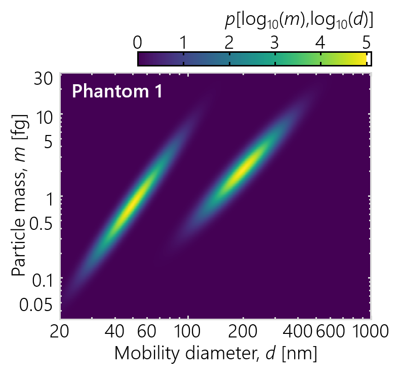

# MATLAB tools for 2D inversion of aerosol characteristics (mat-2d-aerosol-inversion)

[](10.17632/sg2zj5yrvr.3)
[](https://lbesson.mit-license.org/)
[]()


**Installation note:** This program has two dependences that are included as submodules: the `cmap` package available at https://github.com/tsipkens/cmap and the `tfer_pma` package available at https://github.com/tsipkens/mat-tfer-pma. As a result, these folders will initially be empty. The submodules can be downloaded manually from the above sources and placed in the `cmap/` and `tfer_pma/` folders respectively. If cloning using git, clone the repository using

```shell
git clone git://github.com/tsipkens/mat-2d-aerosol-inversion --recurse-submodules
```

which will automatically download the submodules. To be used directly, these packages should then be added to MATLAB path at the beginning of any script using

```Matlab
addpath tfer_pma cmap;
```

For `tfer_pma`, calls to the `+kernel` package will add this folder to the path automatically, whenever necessary, such that it is not necessary to explicitly include the above command. For `cmap`, one could also replace references in existing scripts to the colormaps that would otherwise be in that package.  


------


This program, originally released with [Sipkens et al. (2020a)][1_JAS1], is designed to invert tandem measurements of aerosol size distributions. This includes the inversion of particle mass analyzer-differential mobility analyzer (PMA-DMA) data to find the two-dimensional mass-mobility distribution. 

The methods in this code are described in two papers that correspond to releases:

**v1.1** - The results of [Sipkens et al. (2020a)][1_JAS1] can be reproduced by running `main_jas20a` in [v1.1][code_v11] of this code. Minor differences in the Euclidean error stem from using a smaller search space when optimizing the regularization parameter for Tikhonov regularization. The narrower range in [v1.1][code_v11] provides a better optimized regularization parameter and thus a slightly smaller Euclidean error. Later updates to this code result in minimal changes to the output of this script. 

**v3.0** - The results of [Sipkens et al. (2020c)][4], currently under review, can be reproduced by running `main_bayes.m` in [v3.0][code_v3] of this code. This version of the code is to be archived with Mendeley Data at [https://doi.org/10.17632/sg2zj5yrvr.3](https://doi.org/10.17632/sg2zj5yrvr.3). The four different phantoms in that work can be realized by changing the integer in the line:

```Matlab
phantom = Phantom('1',span_t);
```

to the corresponding phantom number (e.g. to `'3'` for the phantom from [Buckley et al. (2017)][3_Buck]). Default runtimes should be under two minutes but will depend on computer hardware. Alternate arrangements of the `run_inversion*` scripts within the main `main_bayes` script will incur very different runtimes, as most attempt to optimize the prior parameter set (up to the order of several hours). 

This program is organized into several: classes (folders starting with the `@` symbol), packages (folders starting with the `+` symbol), and scripts that form the base of the program and will be detailed in this README.

## 1. General description and problem definition

Size characterization is critical to understanding the role of aerosols in various roles, ranging from climate change to novel nanotechnologies. Aerosol size distributions have typically been resolved only with respect to a single quantity or variable. With the increasing frequency of tandem measurements, this program is designed to move towards inferring two-dimensional distributions of aerosol particle size. This kind of analysis requires a double deconvolution, that is the inversion of a double integral. While this may complicate the process, the information gained is quite valuable, including the distribution of aerosol quantities and the identification of multiple particle types which may be challenging from one-dimensional analyses or when simply computing summary parameters.

Mathematically, the problem to be solved here is of the form

=N_{\text{tot}}\int_0^{\infty}{\int_0^{\infty}{K(a_i*,b_i*,a,b)\cdot{p(a,b)}\cdot\text{d}a\cdot\text{d}b}})

where:
- *a* and *b* are two aerosol properties (e.g. the logarithm of the particle
mass and mobility diameter, such that *a* = log<sub>10</sub>*m* and *b* =
log<sub>10</sub>*d*<sub>m</sub>);
- *N<sub>i</sub>* is some measurement, most often a number of counts of
particles, at some *i*<sup>th</sup> measurement setpoint or location;
- *N*<sub>tot</sub> is the total number of particles in the measured volume of
aerosol, that is the product of the particle number concentration, the flow rate,
and the total sampling time;
- *K*(*a<sub>i</sub>**,*b<sub>i</sub>**,*a*,*b*)
is a kernel containing device transfer functions or other discretization information;
and *p*(*a*,*b*) is a two-dimensional size distribution.

Inversion refers to finding *p*(*a*,*b*) from some set of measurements, {*N*<sub>1</sub>,*N*<sub>2</sub>,...}. For computation, the two-dimensional size distribution is discretized, most simply by representing the quantity on a regular rectangular grid with *n*<sub>a</sub> discrete points for the first type of particle size (that is for *a*, e.g. particle mass) and *n*<sub>b</sub> for the second type of particle size (that is for *b*, e.g. particle mobility diameter). In this case, we define a global index for the grid, *j*, and vectorize the distribution, such that

)

This results is a vector with *n*<sub>a</sub> x *n*<sub>b</sub> total entries. This vectorized form is chosen over a two-dimensional **x** so that the problem can be represented as a linear system of equations. Here, the solution is assumed to be uniform within each element, in which case

{\approx}N_{\text{tot}}\sum_{j=1}^{n_a\cdot{n_b}}{p(a_j,b_j)\int_{a_j}{\int_{b_j}{K(a_i*,b_i*,a_j,b_j)\cdot\text{d}a\cdot\text{d}b}}})

(where the integrals are over the two-dimensional area of the *j*<sup>th</sup> element
in [*a*,*b*]<sup>T</sup> space). This results is a linear system of equations of the form


where **b** is the data vector (i.e. *b<sub>i</sub>* = *N<sub>i</sub>*); **A** is a discrete form of the kernel,

\cdot\text{d}a\cdot\text{d}b}})

and **e** is a vector of measurement errors that corrupt the results of **Ax**. This is the problem that the current code is designed to solve.


## 2. Scripts in upper directory

### 2.1 Main scripts (main*.m)

The `main*` scripts in the top directory of the program constitute the primary code
that can be called to demonstrate use of the code. The are generally composed of
four parts.

##### 2.1.1 General structure: Four parts

**STEP 1**: Optionally, one can define a phantom used to generate synthetic data and a ground truth. The `Phantom` class, described in Section [3.2](#32-phantom-class), is designed to perform this task. The results is an instance of the `Grid` class, which is described in Section [3.1](#31-grid-class), and a vector, `x_t`, that contains a vectorized form of the phantom distribution, defined on the output grid.

**STEP 2A**: One must now generate a model matrix, `A`, which relates the distribution, `x`, to the data, `b`, such that **Ax** = **b**. This requires one to compute the transfer functions of all of the devices involved in the measurement as well as the grids on which `x` and `b` are to be defined. For phantom distributions, the grid for `x` can generated using the `Phantom` class. In all other cases, the grid for `x` and `b` can be generated by creating an instance of the `Grid` class described below.

**STEP 2b**: One must also define some set of data in an appropriate format. For simulated data, this is straightforward: `b = A*x;`. For experimental data, the data should be imported along with either (i) a grid on which the data is defined or (ii) using a series of setpoints for the DMA and PMA. For experimental data, one must have knowledge of the setpoint before computing `A`. Accordingly, the data may first be imported prior to Step 2A. Also in this step, one should include some definition of the expected uncertainties in each point in `b`, encoded in the matrix `Lb`. For those cases involving simple counting noise, this can be approximated as

```Matlab
Lb = diag(1./sqrt(1/Ntot.*b));
```

where `Ntot` is the total number of particle counts as described in [Sipkens et al. (2020a)][1_JAS1]. The function `tools.get_noise` is included to help with noise creation and more information on the noise model is provided in [Sipkens et al. (2017)][6_AO17].

**STEP 3**: With this information, one can proceed to implement various inversion approaches, such as those available in the `invert` package described below. Preset groupings on inversion approaches are available in the `run_inversions*` scripts, also described below.

**STEP 4**: Finally, one can post-process and visualize the results as desired. The `Grid` class allows for a simple visualization of the inferred distribution by calling the `Grid.plot2d_marg` method of this class. This plots both the retrieved distribution as well as the marginalized distribution on each of the axes, taking the reconstruction (e.g. `x_tk1`, `x_lsq`) as an input.

### 2.2 Scripts to run a series of inversion methods (run_inversions*.m)

As noted above, these scripts are intend to bundle a series of inversion methods into a single line of code in the `main*` scripts. This can include optimization routines, included in the `+optimize` package, which run through several values of the regularization parameters. The lettered scripts each denote different combinations of techniques. The `run_inversions_a` script, for example, attempts to optimize the regularization parameter in the Tikhonov, MART, Twomey, and Twomey-Markowski approaches. Other lettered scripts combine other sets of inversion techniques. 

## 3. Classes

### 3.1 Grid class

Grid is a class developed to discretize a parameter space (e.g. mass-mobility space).
This is done using a simple rectangular grid that can have linear, logarithmic
or custom spaced elements along the edges. Methods are designed
to make it easier to deal with gridded data, allowing users to reshape
vectorized data back to a 2D grid (`Grid.reshape` method) or vice versa. Other
methods allow for plotting the 2D representation of vector data (`Grid.plot2d` method) or calculate the gradient of vector data (`Grid.grad` method).

Instances of the Grid class can primarily be constructed in two ways. First,
one can specify a `Grid.span` for the grid to cover in the parameter space. The span
is specified using a 2 x 2 matrix, where the first row corresponds to the
span for the first dimension of the parameter space (e.g. mass) and the second
row corresponds to the span for the second dimension of the parameter space (e.g. mobility).
For example, if one wanted to logarithmically discretize mass space between
0.01 and 100 fg and mobility space between 10 and 1000 nm, one could call:

```Matlab
span = [0.01,100; 10,1000]; % span of space to be covered
ne = [10,12]; % number of elements for each dimension
grid = Grid(span,ne,'logarithmic'); % create instance of Grid
```

Second, one can supply a 1 x 2 cell array of edges, where the first entry is the center
of the elements in the first dimension of parameter space and the second entry
of the elements in the second dimension of parameter space. For example, to make
a simple grid with elements at 0.1 and 1 fg in mass space and
10, 200, and 1000 nm in mobility space, one would call:

```Matlab
edges = {[0.1,1], [10,200,1000]}; % cell array of edge vectors
grid = Grid(edges,[],'logarithmic'); % create instance of Grid
```

Note that the number of elements is not required in this instance, as it is
implied by the length of the vectors given in `edges`. The `'logarithmic'`
argument is still required to specify where nodes would be placed between
the elements.

Both the data, **b**, and two-dimensional size distribution, **x**, vectors
can be defined with respect to an instance of this class. Generally, the data
will only rely on the center of the elements on the grid (the width of the grid
elements has little meaning for data).
The vectors are arranged such that the first entry corresponds
to the smallest size in both dimensions. The vector proceeds, first with
increasing the first size dimension (e.g. for mass-mobility distributions this is mass
by default) and then with increasing the second size dimension. Vectorizing the
2D gridded data can be done using the colon operand, i.e. `x(:)`, or using
the `vectorize` method.

##### 3.1.1 Support for partial grids

The current program also supports creating partial grids, made up of a regular grid where certain elements are ignored or missing. This allows practitioners to ignore certain regions in the grid that may have higher uncertainties or are otherwise unphysical. Quantities defined on partial grids have a reduced dimension, often speeding inversion.

For mass-mobility measurements, this can be used to block out particles with extraordinarily high or low densities.

These partial grids are also useful for PMA-SP2 inversion, where part of the grid will be unphysical. 

Partial grids can be created using the `Grid.partial`, which cuts the grid about a line specified by a y-intercept and slope. All of the grid points with a center above this line is removed from the grid. For example, if one wanted to create a grid where all of the points above the 1-1 line should be removed
(as is relevant for PMA-SP2 inversion), one can call

```Matlab
grid = grid.partial(0,1);
```

which replaces the current grid with a partial grid with the same span. For partial grids:

1. `Grid.ispartial` will be 1 (i.e. true),
2. `Grid.missing` contains a list of the global indices for the missing pixels,
3. `Grid.cut` contains the y-intercept and slope of the line used in making the cut (which is used in marginalization to only partially weight points that are cut off),
4.	`Grid.elements` is updated to only list the center of the elements that
are left in the grid (i.e. have indices that are not listed in `Grid.ismissing`),
5.	`Grid.nelements` similarly only lists the edges of pixels that remain in the partial grid, and
6.	`Grid.adj` is updated to only list the elements/pixels that are adjacent on the partial grid.

The `Grid.edges` and `Grid.nodes` properties remain unchanged and refer to the underlying grid structure prior to any of the grid points being removed.

Methods specific to partial grids include:
1.	`Grid.partial2full(x)` will convert a partial x (resolved with only the remaining points on the grid) to one resolved on the original grid, filling the missing points with zeros. I use this to plot and marginalize the distributions (i.e. plots will have zeros in all of the missing elements/pixels) and
2.	`Grid.full2partial(x)` will do the reverse of above, converting a full x (with all of the points from the original grid) to one resolved on the partial grid.

Most other Grid methods will operate on partial grids. For example, the `Grid.marginalization` method will only sum the pixels that are still on the grid (exploiting the fact that the other pixels are necessarily zero), including accounting for the fact that pixels on the diagonal are only half pixels (i.e. they are triangles rather than rectangular elements). The `Grid.plot2d` method, equally, will plot zeros in the upper left triangle. The `Grid.l1` method will generate the first-order Tikhonov L matrix for the modified grid (only considering pixels that are adjacent on the partial grid). The `Grid.ray_sum` method will sum the distribution along some ray (i.e. along some line), assuming missing pixels are zero and do not contribute to the ray-sum. The list goes on.

### 3.2 Phantom class

Phantom is a class developed to contain the parameters and other information for the phantom distributions that are used in testing the different inversion methods. Currently, the phantom class is programmed to primarily produce bivariate lognormal distributions and secondarily distributions that are lognormal with mobility and conditionally normal for mass following [Buckley et al. (2017)][3_Buck]. Bivariate normal distributions can also be represented by the class but will suffer from a loss of support from some of the class's methods. 

Instances of the Phantom class can be created in four ways. We explicitly note that *the first two options are unique in that they represent different parameterizations of the phantom*. 

##### 3.2.2 OPTION 1: The 'standard' parameterization

The '**standard**' parameterization is explicitly for bivariate lognormal distributions (though it can equally be used for standard bivariate normal distributions). In this case, the user specifies a mean, `Phantom.mu`, and covariance, `Phantom.Sigma`, defined in [*a*, *b*]<sup>T</sup> space, where, as before, *a* and *b* are two aerosol size parameters. The bivariate lognormal form, such as when *a* = log<sub>10</sub>*m* and *b* = log<sub>10</sub>*d*, generally receives more support across this program. 

For this scenario, instances of the class are created by calling:

```Matlab
phantom = Phantom('standard',grid,mu,Sigma);
```

where `grid` is an instance of the Grid class described above. For example, for a mass-mobility distribution,

```Matlab
span = [0.01,100; 10,1000]; % span of grid
ne = [550,600]; % elements in grid
grid = Grid(span,ne,'logarithmic'); % create instance of Grid

phantom = Phantom('standard',grid,[-0.105,1.70],... % distribution mean
	[0.205,0.0641;0.0641,0.0214]); % covariance information

grid.plot2d_marg(phantom.x); % plot the resultant phantom
```

will produce and plot a bivariate lognormal distribution centered at *m* = 0.785 fg and *d* = 50 nm and with covariance information corresponding to geometric standard deviations of σ<sub>d</sub> = 10<sup>sqrt(0.0214)</sup> = 1.4 and σ<sub>m</sub> = 10<sup>sqrt(0.205)</sup> = 2.84 and a correlation of *R* = 0.968. Similarly, for a bimodal, bivariate lognormal phantom, 

```Matlab
span = [0.01,100; 10,1000]; % span of grid
ne = [550,600]; % elements in grid
grid = Grid(span,ne,'logarithmic'); % create instance of Grid

phantom = Phantom('standard',grid,...
	{[0,2],[1,2.5]},... % distribution means
	{[0.205,0.0641;0.0641,0.0214],... % covaraince of mode no. 1
	[0.126,0.0491;0.0491,0.0214]}); % covaraince of mode no. 2

grid.plot2d_marg(phantom.x); % plot the resultant phantom
```

adds a second mode at *m* = 2.09 fg and *d* = 200 nm to the distribution produced in the first example. We note that this latter example is Phantom no. 1 (i.e. the demonstration phantom) from [Sipkens et al. (2020a)][1_JAS1]. 

##### 3.2.1 OPTION 2: The 'mass-mobility' parameterization

The '**mass-mobility**' parameterization uses a `p` structured array, which is built specifically for mass-mobility distributions. The required fields for this structure are: 

1.  `dg` -  Mean mobility diameter
2. `sg` -  Standard deviation of the mobility diameter 
3. `Dm` -  Mass-mobility exponent
4. *Either:*

    `sm` - Standard deviation of the particle mass
    
    `smd` - Standard deviation of the conditional mass distribution
    
5.  *Either:*
    
    `mg` -  Mean particle mass
    
    `rhog` - Effective density of at the mean mobility diameter

For lognormal modes, means should be geometric means and standard deviations should be geometric standard deviations. Remaining entries of the `p` structure will be filled using the `Phantom.fill_p` method. (We note that `p = Phantom.fill_p(p);` can be used to fill out the `p` structure without the need to create an instance of the Phantom class.)

For this scenario, instances of the class are generated by calling:

```Matlab
phantom = Phantom('mass-mobility',grid,p,modes);
```

where, as before, `grid` is an instance of the Grid class described above, `p` is the structured array containing the mass-mobility properties, and, `modes` indicates the type of mode that the `p` structure represents. The final argument is a cell of strings, with one cell entry per mode and where each string can be either:

1. `'logn'` - indicating a bivariate lognormal mode and
2. `'norm'` - indicating a conditionally-normal distribution, where the mobility diameter distribution is lognormal and the conditional mass distribution is normal. This mode type represents the type of phantoms defined by [Buckley et al. (2017)][3_Buck]. 

To exemplify this procedure, the unimodal phantom from the previous section can generated by

```Matlab
span = [0.01,100; 10,1000]; % span of grid
ne = [550,600]; % elements in grid
grid = Grid(span,ne,'logarithmic'); % create instance of Grid

p.dg = 50; p.rhog = 12000; % geometric means
p.sg = 1.4; p.smd = 1.3; % geometric standard deviations
p.Dm = 3; % mass-mobility exponent
phantom = Phantom('mass-mobility',grid,p,{'logn'}); % create phantom

grid.plot2d_marg(phantom.x); % plot the resultant phantom
```

noting that the final entry must still be enclosed by curly braces. One can generate a multimodal phantom by stacking multiple entries in the `p` structure and adding the same number of entire to the `modes` cell. For example, to produce Phantom no. 1, 

```Matlab
span = [0.01,100; 10,1000]; % span of grid
ne = [550,600]; % elements in grid
grid = Grid(span,ne,'logarithmic'); % create instance of Grid

% distribution parameters:
% mode 1           mode 2
p(1).dg = 50;      p(2).dg = 200;
p(1).rhog = 12000; p(2).rhog = 500;
p(1).sg = 1.4;     p(2).sg = 1.4;
p(1).smd = 1.3;    p(2).smd = 1.3;
p(1).Dm = 3;       p(2).Dm = 2.3;

phantom = Phantom('mass-mobility',grid,p,{'logn','logn'});
	% create phantom

grid.plot2d_marg(phantom.x); % plot the resultant phantom
```

where the distribution parameters match those from [Sipkens et al. (2020a)][1_JAS1]. 

##### 3.2.3 Converting between the 'standard' and 'mass-mobility' parameterizations

In both cases, creating an instance of the class will also contain the information corresponding to the other creation method (e.g. using a `p` structure, the class constructor will determined the corresponding mean and covariance information and store this in `Phantom.mu` and `Phantom.Sigma`). This can be demonstrated by investigating the examples provided in the proceeding sections, which generate the same phantom, save for rounding errors.  Conversion between the '**standard**' parameterization and the '**mass-mobility**' parameterizations can be accomplished using the `Phantom.cov2p` method of the Phantom class and vice versa using the `Phantom.p2cov` method of the Phantom class. 

##### 3.2.4 OPTION 3: Preset phantoms

Use a preset or sample distribution, which are loaded using a string and the `presets` function, which is defined external to the main Phantom class definition for easier access. For example, the four sample phantoms from [Sipkens et al. (2020a)][1_JAS1] can be called using strings encompassing the distribution numbers or names from that work (e.g. the demonstration phantom can be generated using `'1'` or `'demonstration'`). The demonstration phantom is indicated in the image below.



Notably, Phantom no. 3, that is the phantom produced by

```Matlab
phantom = Phantom('3');
```

corresponds to the one used by [Buckley et al. (2017)][3_Buck] and demonstrates a scenario which uses a conditionally-normal mass distribution. 

##### 3.2.4 OPTION 4: Using the Phantom class's fit methods

For experimental data, the Phantom class can also be used to derive morphological parameters from the reconstructions. 

Of particular note, the `Phantom.fit` method, which is defined external to the main definition of the Phantom class, takes a reconstruction, `x` and the grid on which it is defined and creates a bivariate lognormal phantom that most resembles the data. This done using least squares analysis. The `p` structure of the Phantom class then contains many of the morphological parameters of interest to practitioners measuring mass-mobility distributions. 

The `Phantom.fit2` method can be used in an attempt to derive multimodal phantoms for the data. This task is often challenging, such that the method may need tuning in order to get distributions that appropriately resemble the data. 

## 4. Packages

### 4.1 +kernel

This package is used to evaluate the transfer function of the different instruments, such as the differential mobility analyzer (DMA), particle mass analyzer (such as the CPMA or APM), and charging fractions. Various functions within this package can generate the matrix `A` that acts as the forward model.

The transfer function for the DMA uses the analytical expressions of [Stozenburg et al. (2018)][Stolz18].

Transfer function evaluation for a PMA can proceed using one of two inputs either (i) a `sp` structure or (ii) an instance of the Grid class defined for the data setpoints. Evaluation proceeds using the analytical expressions of [Sipkens et al. (2020b)][2_AST] and the tfer_pma package provided with that work. The package uses a `sp` structure to define the PMA setpoints.

##### 4.1.1 sp

The `sp` or setpoint structure is a structured array containing the information necessary to define the PMA setpoints. Defining the quantity requires a pair of parameters and a property structure defining the physical dimensions of the PMA. Pairings can be converted into a `sp` structured array using the `tfer_pma.get_setpoint` function described below and in the README for the tfer_pma package. Generally, this function can be placed inside a loop that generates an entry in `sp` for each available setpoint. The output structure will contain all of the relevant parameters that could be used to specify that setpoint, including mass setpoint (assuming a singly charged particle), `m_star`; the resolution, `Rm`; the voltage, `V`; and the electrode speeds, `omega*`. A sample `sp` is shown below.

| Fields  | m_star    | V      | Rm  | omega | omega1 | omega2 | alpha | beta  | m_max    |
| ------- | :-------: | :----: | :-: | :---: | :----: | :----: | :---: | :---: | :------: |
| 1       | 4.51×10<sup>-19</sup> |	81.638 | 3  | 692.6 | 703.4  | 682.0 |	47.91 |	2.359 |	6.01×10<sup>-18</sup> |
| 2       | 7.67×10<sup>-19</sup> |	110.68 | 3  | 618.3 | 627.9  | 608.9 |	42.77 |	2.106 |	1.02×10<sup>-18</sup> |
| 3       | 1.30×10<sup>-18</sup> |	148.76 | 3  | 549.5 | 558.1  | 541.2 |	38.01 |	1.872 |	1.74×10<sup>-18</sup> |
| 4       | 2.22×10<sup>-18</sup> |	198.02 | 3  | 486.1 | 493.7  | 478.7 |	33.63 |	1.656 |	2.96×10<sup>-18</sup> |
| ... ||||||||||

As an example, the array can be generated from a vector of mass setpoints assuming
a resolution of *R*<sub>m</sub> = 10 and PMA properties specified in `kernel.prop_pma` using:

```Matlab
m_star = 1e-18.*logspace(log10(0.1),log10(100),25); % mass setpoints
sp = tfer_pma.get_setpoint(prop_pma,...
    'm_star',m_star,'Rm',10); % get PMA setpoints
```

##### 4.1.2 Exploiting the gridded structure of that data

Alternatively, one can generate a grid corresponding to the data points. This can
speed transfer function evaluation be exploiting the structure of the setpoints
to minimize the number of function evaluations (using the `kernel.gen_grid` function).

### 4.2 tfer_pma

Unlike the other packages, tfer_pma corresponds to a submodule that is imported from a package distributed with [Sipkens et al. (2020b)][2_AST] and is available in a parallel repository [https://github.com/tsipkens/mat-tfer-pma](https://github.com/tsipkens/mat-tfer-pma). It does not contain a `+` symbol and thus must be added to the MATLAB path using

```Matlab
addpath('tfer_pma','cmap');
```

to be used explicitly in scripts. The package is automatically added to the MATLAB path, whenever it is necessary in calling functions in the kernel package. The package is used in evaluating the transfer function of the particle mass analyzers (PMAs), such as the aerosol particle mass analyzer (APM) and centrifugal particle mass analyzer (CPMA). PMA transfer functions are evaluated using the analytical transfer functions derived by [Sipkens et al. (2020b)][2_AST], including different approximations for the particle migration velocity and options for transfer functions that include diffusion. For more details on the theory, one is referred to the referenced work. The package also contains some standard reference functions (e.g. `dm2zp`) used in evaluating the DMA transfer function when calling `kernel.tfer_dma`.

### 4.3 +invert

The invert package contains various functions used to invert the measured data for the desired two-dimensional distribution. This includes implementations of least-squares, Tikhonov regularization, Twomey, Twomey-Markowski (including using
the method of [Buckley et al. (2017)][3_Buck]), and the multiplicative algebraic reconstruction technique (MART).

An important note in connection with these methods is that they do not have the matrix `Lb` as an input. This is done for two reasons:

1. to allow for the case where the data noise is entirely unknown, thereby considering a traditional, unweighted least-squares analysis (though, this is not recommended) and

2. to avoid unnecessary repeat computation of the products `Lb*A` and `Lb*b`.

To incorporate `Lb`, use `Lb*A` and `Lb*b` when calling the inversion functions for the input `A` and `b` arguments.

Details on the available approaches to inversion are provided in the associated paper, [Sipkens et al. (2020a)][1_JAS1].

Development is underway on the use of an exponential distance covariance function to correlate pixel values and reduce reconstruction errors [Sipkens et al. (2020c)][4].

### 4.4 +optimize

This package mirrors the content of the +invert package but aims to determine the optimal number of
iterations for the Twomey and MART schemes or the optimal prior parameter set for the other methods. This includes some methods aimed to optimize the prior/regularization parameters used in the reconstructions, without knowledge of the data.

Of particular note are a subset of the methods that implement evaluation of the Bayes factor for a range of methods, namely the `optimize.bayesf*.m` methods. The functions have inputs that mirror the functions in the `invert` package, this means that data uncertainties can be included
in the procedure by giving `Lb*A` as an input to the program in the place of `A`. The methods general take `lambda` as a separate parameter, to promote the stability of the algorithm.
More details on this method are found in [Sipkens et al. (2020c)][4]. Appendix C of that work includes a discussion of the special considerations required to compute the determinants of the large covariance matrices in this problem. 

### 4.5 +tools

A series of utility functions that serve various purposes, including printing
a text-based progress bar (based on code from [Samuel Grauer](https://www.researchgate.net/profile/Samuel_Grauer)) and a function to convert mass-mobility distributions to effective density-mobility distributions.

The `tools.overlay*` functions produce overlay to be placed on top of plots in
mass-mobility space. For example, `tools.overlay_phantom` will plot the line
corresponding to the least-squares line representative of the phantom (equivalent
to the mass-mobility relation for mass-mobility phantoms) and ellipses representing
isolines. By default, the function plots one, two, and three standard deviations from the center of the distribution, accounting for the correlation encoded in the distribution. 

----------------------------------------------------------------------

#### License

This software is licensed under an MIT license (see the corresponding file for details).

#### How to cite

This work can be cited in two ways.

1. If the methods are used, but the code is not, please cite [Sipkens et al. (2020a)][1_JAS1].
Note that if the Twomey-Markowski approach is used one should also cite [Buckley et al. (2017)][3_Buck], and if particle mass analyzer transfer function evaluation is discussed, one should cite [Sipkens et al. (2020b)][2_AST].

2. If this code is used directly, cite: (*i*) this [code][5_code] (including the DOI, included at the top) and (*ii*) the associated paper describing the methods, [Sipkens et al. (2020a)][1_JAS1]. Also note that additional references
to [Buckley et al. (2017)][3_Buck] and [Sipkens et al. (2020b)][2_AST] should also be considered as per above.

#### Contact information and acknowledgements

This program was largely written and compiled by Timothy Sipkens ([tsipkens@mail.ubc.ca](mailto:tsipkens@mail.ubc.ca)) while at the
University of British Columbia. Code excerpts were contributed by [@ArashNaseri](https://github.com/ArashNaseri) from the University of Alberta, including implementation of the L-curve optimization method of [Cultrera and Callegaro (2016)][7_CC_Lcurve] among other optimizations. 

Also included is a reference to code designed to quickly evaluate the transfer function of particle mass analyzers (e.g. APM, CPMA) by [Sipkens et al. (2020b)][2_AST]. See the parallel repository parallel repository [https://github.com/tsipkens/mat-tfer-pma](https://github.com/tsipkens/mat-tfer-pma) for more details. 

This distribution includes code snippets from the code provided with the work of [Buckley et al. (2017)][3_Buck],
who used a Twomey-type approach to derive two-dimensional mass-mobility distributions. Much of the code from that work has been significantly modified in this distribution.

The authors would also like to thank [@sgrauer](https://github.com/sgrauer) for consulting on small pieces of this code (such as the MART code and the `tools.textbar` function).

Information on the provided colormaps can be found in an associated README in the `cmap` folder.

#### References

[Buckley, D. T., Kimoto, S., Lee, M. H., Fukushima, N., & Hogan Jr, C. J. (2017). Technical note: A corrected two dimensional data inversion routine for tandem mobility-mass measurements. *J. Aerosol Sci.* 114, 157-168.][3_Buck]

[Cultrera, A., & Callegaro, L. (2016). A simple algorithm to find the L-curve corner in the regularization of inverse problems. arXiv preprint arXiv:1608.04571.][7_CC_Lcurve]

[Sipkens, T. A., Olfert, J. S., & Rogak, S. N. (2019). MATLAB tools for PMA transfer function evaluation (mat-tfer-pma). Zenodo. DOI: 10.5281/zenodo.3513259][5_code]

[Sipkens, T. A., Hadwin, P. J., Grauer, S. J., & Daun, K. J. (2017). General error model for analysis of laser-induced incandescence signals. *Appl. Opt.* 56, 8436-8445.][6_AO17]

[Sipkens, T. A., Olfert, J. S., & Rogak, S. N. (2020a). Inversion methods to determine two-dimensional aerosol mass-mobility distributions: A critical comparison of established methods. *J. Aerosol Sci.* 140, 105484.][1_JAS1]

[Sipkens, T. A., Olfert, J. S., & Rogak, S. N. (2020b). New approaches to calculate the transfer function of particle mass analyzers. *Aerosol Sci. Technol.* 54, 111-127.][2_AST]

[Sipkens, T. A., Olfert, J. S., & Rogak, S. N. (2020c). Inversion methods to determine two-dimensional aerosol mass-mobility distributions II: Existing and novel Bayesian methods.][4]

[Stolzenburg, M. R. (2018). A review of transfer theory and characterization of measured performance for differential mobility analyzers. *Aerosol Sci. Technol.* 52, 1194-1218.][Stolz18]

[1_JAS1]: https://doi.org/10.1016/j.jaerosci.2019.105484
[2_AST]: https://doi.org/10.1080/02786826.2019.1680794
[3_Buck]: https://doi.org/10.1016/j.jaerosci.2017.09.012
[4]: N/A
[5_code]: https://10.5281/zenodo.3513259
[6_AO17]: https://doi.org/10.1364/AO.56.008436
[7_CC_Lcurve]: https://arxiv.org/abs/1608.04571
[Stolz18]: https://www.tandfonline.com/doi/full/10.1080/02786826.2018.1514101
[code_v11]: https://github.com/tsipkens/mat-2d-aerosol-inversion/releases/tag/v1.1
[code_v3]: https://github.com/tsipkens/mat-2d-aerosol-inversion/releases/tag/v3.0

