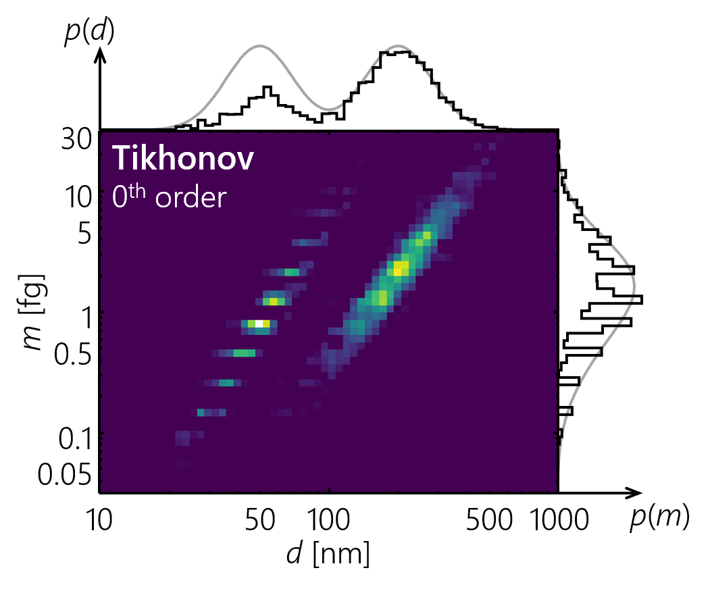

# MATLAB tools for 2D inversion of aerosol characteristics (mat-2d-aerosol-inversion)

This program, originally released with [Sipkens et al. (2020a)][1_JAS1],
is designed to invert tandem particle mass analyzer-differential mobility analyzer
(PMA-DMA) data to find the two-dimensional mass-mobility distribution.

The results of the aforementioned paper can be produced by running `main_jas19`
in [v1.1][code_v11] of this code. See Section
[1.1.2](#1.1.2-script-associated-with-j.-aerosol-sci.-paper)
of this README for more details.

This program is organized into several: classes (folders starting with the `@` symbol),
packages (folders starting with the `+` symbol), and scripts that form the
base of the program.

## 1. Scripts in upper directory

### 1.1 Main scripts (main*.m)

The `main*` scripts in the top directory of the code can be called to
demonstrate use of the code.

##### 1.1.1 General structure

Scripts to execute this program should be structured as follows:

- **STEP 1**: Optionally, one can define a phantom used to generate synthetic data and a
ground truth. The `Phantom` class, described below, is designed to
perform this task. The results is an instance of the `Grid` class, which is
also described below, and a vector, `x_t`, that contains a vectorized form of
the phantom distribution, defined on the output grid.

- **STEP 2A**: One must now generate a model matrix, `A`, which relates the distribution,
`x`, to the data, `b`, such that **Ax** = **b**. This requires one to compute
the transfer functions of all of the devices involved in the measurement
as well as the grids on which `x` and `b` are to be defined.
For phantom distributions, the grid for `x` can generated using
the `Phantom` class. In all other cases, the grid for `x` and `b` can be
generated by creating an instance of the `Grid` class described below.

- **STEP 2b**: One must also define some set of data in an appropriate format. For
simulated data, this is straightforward: `b = A*x;`. For experimental data, the data
should be imported along with either (i) a grid on which the data is defined or
(ii) using a series of setpoints for the DMA and PMA. For experimental data,
one must have knowledge of the setpoint before computing `A`. Accordingly,
the data may first be imported prior to Step 2A.
Also in this step, one should include some definition of the
expected uncertainties in each point in `b`, encoded in the matrix
`Lb`. For those cases involving counting noise, this can be
approximated as `Lb = theta*diag(sqrt(b));`, where `theta` is
related to the total number of particle counts as described in
[Sipkens et al. (2020a)][1_JAS1]. The function `add_noise` is
included in the `+tools` package to help with noise creation, and more
information on the noise model is provided in [Sipkens et al. (2017)][6_AO17].

- **STEP 3**: With this information, one can proceed to implement various inversion
approaches, such as those available in the `+invert` package described below.
Preset groupings on inversion approaches are available in the
`run_inversions*` scripts, also described below.

- **STEP 4**: Finally, one can post-process and visualize the results as desired. The
`Grid` class allows for a simple visualization of the inferred distribution
by calling the `plot2d_marg` method of this class (see image below). This plots both the
retrieved distribution as well as the marginalized distribution on each of
the axes, taking the reconstruction (e.g. `x_tk1`, `x_lsq`) as an input.

##### 1.1.2 Script associated with the original J. Aerosol Sci. paper

Of particular note, the `main_jas19.m` script is designed to replicate the results
in the associated paper [Sipkens et al. (2020a)][1_JAS1], as noted above. Minor
differences in the Euclidean error stem from using a smaller search space when
optimizing the regularization parameter for Tikhonov regularization. The narrower
range in the updated code provides a better optimized regularization parameter
and thus a slightly smaller Euclidean error.

### 1.2 Scripts to run a series of inversion methods (run_inversions*.m)

As noted above, these scripts are intend to bundle a series of
inversion methods into a single line of code in the `main*` scripts.
 This can include optimization routines, included in the `+invert`
 package, which run through several values of the regularization parameters.

The lettered scripts roughly perform as follows:

- `run_inversions_a` - Attempts to optimize the regularization parameter in
the Tikhonov, MART, Twomey, and Twomey-Markowski approaches.

- `run_inversions_b` - Re-runs inversion at the set of optimal parameters
produced by *run_inversions_a.m*. Can be modified to adjust the optimization
approach used in the Tikhonov solvers (e.g. specifying the `'non-neg'` option).

- `run_inversions_c` - A simple set of the Tikhonov and Twomey approaches where
the user must explicitly set the regularization parameter of the Tikhonov
schemes.

- `run_inversions_d` - Run the inversion methods multiple times and time the
length of time required to produce a reconstruction.

- ...

## 2. Classes

Classes are contained in folders starting with the `@` symbol.

### 2.1 Grid class

Grid is a class developed to discretize a parameter space (e.g. mass-mobility space).
This is done using a simple rectangular grid that can have linear, logarithmic
or custom spaced elements along the edges. Methods are designed
to make it easier to deal with gridded data, allowing users to reshape
vectorized data back to a 2D grid (`reshape` method) or vice versa. Other
methods allow for plotting the 2D representation of vector data (`plot2d` method) or
calculate the gradient of vector data (`grad` method). More information is available
in the class definition.

Both the **b** and **x** vectors are defined with respect to an instance of
this class. The vectors are arranged such that the first entry corresponds
to the smallest mass and mobility diameter. The vector proceeds, first with
increasing mass and then with increasing mobility diameter. Vectorizing the
2D gridded data can be done using the colon operand, i.e. `x(:)`, or using
the `vectorize` method.

### 2.2 Phantom class

Phantom is a class developed to contain the parameters and other information
for the phantom distributions that are used in testing the different inversion
methods. Currently, the phantom class is programmed to primarily produce
bivariate lognormal distributions and secondarily distributions
that are lognormal with mobility and conditional normal for mass
following [Buckley et al. (2017)][3_Buck].

The Phantom class parameterizes the aerosol distribution in two
possible ways:

- **OPTION 1**: Most generally, the class parameterized the distribution
using a mean, `mu`, and covariance matrix, `Sigma`. For lognormal-lognormal
distributions, the mean and covariance are given in
[log10*m*, log10*d*]T
space. For phantoms of the form provided by [Buckley et al. (2017)][3_Buck]
are lognormal in mobility diameter space and conditionally normally
distributed in mass space.

- **OPTION 2**: The distribution is parameterized using the typical
mass-mobility parameters, stored in the `p` field. This includes
parameters, such as the geometric mean diameter, `dg`;
mass-mobility exponent, `Dm`; and the effective density of particles
with a mobility diameter of 100 nm `rho_100`.

- **OPTION 3**: Use a preset or sample distribution, which are loaded using
a string and the `preset_phantoms` function. For example, the four sample phantoms from
[Sipkens et al. (2020a)][1_JAS1] can be called using strings encompassing
the distribution numbers or names from that work (e.g. the demonstration phantom
can be generated using `'1'` or `'demonstration'`).

Conversion between the `mu` and `Sigma` parameterization and the
`p` structure parameterization can be accomplished using the `cov2p`
method of the Phantom class and vice versa using the `p2cov`
method of the Phantom class.

For experimental data, the Phantom class can also be used to derive
morphological parameters from the reconstructions. Of particular note,
the `fit` method of the Phantom class, takes a reconstruction, `x` and
the grid on which it is defined and creates a bivariate lognormal
phantom that most resembles the data. This done using least squares
analysis. The `p` properties of the Phantom class then contains many of the
morphological parameters of interest to practitioners measuring
mass-mobility distributions.

## 3. Packages

### 3.1 +kernel

This package is used to evaluate the transfer function of the DMA and
particle mass analyzer (such as the CPMA or APM). The primary function
within the larger program is to generate a matrix `A` that acts as the
forward model. This package references the `tfer_pma` package, noted
above.

As per Step 2 in Section 1.1.1, the transfer function evaluation can
proceed using two inputs either (i) a `sp` structure or (ii) an instance
of the `Grid` class defined for the data setpoints.

##### 3.1.1 sp

The `sp` or setpoint structure is a structured array containing the information
necessary to define the device setpoints. For a DMA, the setpoint mobility diameter,
`d_star`, is sufficient to accomplish this task. For a PMA, a pair of parameters
is required to establish the setpoint. Pairings can be converted into a `sp` structured
array using the `get_setpoint` function included with the `tfer_pma` package described
below. Generally, this function can be placed inside a loop that generates an entry
in `sp` for each available setpoint. The output structure will contain all of the
relevant parameters that could be used to specify that setpoint, including
mass setpoint (assuming a singly charged particle), `m_star`; the resolution, `Rm`;
the voltage, `V`; and the electrode speeds, `omega*`.

##### 3.1.2 grid_b

Alternatively, one can generate a grid corresponding to the data points. This can
speed transfer function evaluation be exploiting the structure of the setpoints
to minimize the number of function evaluations (using the `gen_A_grid` function).

### 3.2 +tfer_pma

This package is used in evaluating the transfer function of the particle mass
analyzers (PMAs), such as the aerosol particle mass analyzer (APM) and centrifugal
particle mass analyzer (CPMA). PMA transfer functions are evaluated using the
analytical transfer functions derived by [Sipkens et al. (2020b)][2_AST], including
different approximations for the particle migration velocity and options for transfer
functions that include diffusion. For more details on the theory, one is referred to
the referenced work. The package also contains some standard reference
functions used in evaluating the DMA transfer function, i.e. in `tfer_dma.m`.

This is imported from a package distributed with [Sipkens et al. (2020b)][2_AST]
and is available in a parallel repository
[https://github.com/tsipkens/mat-tfer-pma](https://github.com/tsipkens/mat-tfer-pma)
and the associated archive [(Sipkens et al., 2019)][5_code].

The current implementation corresponds to v1.3 of that code.

### 3.3 +invert

The invert package contains various functions used to invert the measured data
for the desired two-dimensional distribution. This includes implementations of
least-squares, Tikhonov regularization, Twomey, Twomey-Markowski (including using
the method of [Buckley et al. (2017)][3_Buck]), and the multiplicative algebraic
reconstruction technique (MART).

An important note in connection with these methods is that they do not have the
matrix `Lb` as an input. This is done for two reasons:

1. to allow for the case where the data noise is entirely unknown, thereby
considering a traditional, unweighted least-squares analysis
(though, this is not recommended) and

2. to avoid unnecessary repeat computation of the products `Lb*A` and `Lb*b`.

To incorporate `Lb`, use `Lb*A` and `Lb*b` when calling the inversion
functions for the input `A` and `b` arguments.

Details on the available approaches to inversion are provided in the
associated paper, [Sipkens et al. (2020a)][1_JAS1].

Development is underway on the use of an exponential
distance covariance function to correlate pixel values and reduce
reconstruction errors [Sipkens et al. (Under preparation)][4].

### 3.4 +optimize

This package mirrors the content of the +inver package but,
given the true distribution, aims to determine the optimal number of
iterations for the Twomey and MART schemes or the optimal regularization
parameter for the Twomey-Markowski and Tikhonov methods. These were mostly
created for internal use but may be of limited to use to the practitioner.

### 3.5 +tools

A series of utility functions that serve various purposes, including printing
a text-based progress bar (based on code from
[Samuel Grauer](https://www.researchgate.net/profile/Samuel_Grauer))
and a function to convert mass-mobility distributions to effective
density-mobility distributions.

The `overlay*` functions produce overlay to be placed on top of plots in
mass-mobility space. For example, `overlay_phantom` will plot the line
corresponding to the least-squares line representative of the phantom (equivalent
to the mass-mobility relation for mass-mobility phantoms) and ellipses representing
isolines one, two, and three standard deviations from the center of the distribution.

----------------------------------------------------------------------

#### License

This software is licensed under an MIT license (see the corresponding file
for details).

#### How to cite

This work can be cited in two ways.

1. If the methods are used, but the code is not,
please cite [Sipkens et al. (2020a)][1_JAS1].
Note that if the Twomey-Markowski approach is used
one should also cite [Buckley et al. (2017)][3_Buck], and if particle mass analyzer
transfer function evaluation is discussed, one should cite [Sipkens et al. (2020b)][2_AST].

2. If this code is used directly, cite: (*i*) this [code][5_code]
(including the DOI, included at the top) and (*ii*) the associated paper describing
the methods, [Sipkens et al. (2020a)][1_JAS1]. Also note that additional references
to [Buckley et al. (2017)][3_Buck] and [Sipkens et al. (2020b)][2_AST]
should also be considered as per above.

#### Contact information and acknowledgements

This program was largely written and compiled by Timothy Sipkens
([tsipkens@mail.ubc.ca](mailto:tsipkens@mail.ubc.ca)) while at the
University of British Columbia.

This distribution includes code snippets from the code provided with
the work of [Buckley et al. (2017)][3_Buck],
who used a Twomey-type approach to derive two-dimensional mass-mobility
distributions. Much of the code from that work has been significantly
modified in this distribution.

Also included is a reference to code designed to quickly evaluate
the transfer function of particle mass analyzers (e.g. APM, CPMA) by
[Sipkens et al. (2020b)][2_AST]. See the parallel repository
parallel repository [https://github.com/tsipkens/mat-tfer-pma](https://github.com/tsipkens/mat-tfer-pma)
for more details.  

The authors would also like to thank
[Samuel Grauer](https://www.researchgate.net/profile/Samuel_Grauer)
for consulting on small pieces of this code (such as the MART code).

Information on the provided colormaps can be found in an associated
README in the `cmap` folder.

#### References

[Buckley, D. T., Kimoto, S., Lee, M. H., Fukushima, N., Hogan Jr, C. J. (2017). Technical note: A corrected two dimensional data inversion routine for tandem mobility-mass measurements. *J. Aerosol Sci.* 114, 157-168.][3_Buck]

[Sipkens, T. A., Olfert, J. S., & Rogak, S. N. (2019). MATLAB tools for PMA transfer function evaluation (mat-tfer-pma). Zenodo. DOI: 10.5281/zenodo.3513259][5_code]

[Sipkens, T. A., Hadwin, P. J., Grauer, S. J., Daun, K. J. (2017). General error model for analysis of laser-induced incandescence signals. *Appl. Opt.* 56, 8436-8445.][6_AO17]

[Sipkens, T. A., Olfert, J. S., & Rogak, S. N. (2020a). Inversion methods to determine two-dimensional aerosol mass-mobility distributions: A critical comparison of established methods. *J. Aerosol Sci.* 140, 105484. DOI: 10.1016/j.jaerosci.2019.105484][1_JAS1]

[Sipkens, T. A., Olfert, J. S., & Rogak, S. N. (2020b). New approaches to calculate the transfer function of particle mass analyzers. *Aerosol Sci. Technol.* 54, 111-127.][2_AST]

[Sipkens, T. A., Olfert, J. S., & Rogak, S. N. (Under preparation). Inversion methods to determine two-dimensional aerosol mass-mobility distributions: Existing and novel Bayesian methods.][4]

[1_JAS1]: https://doi.org/10.1016/j.jaerosci.2019.105484
[2_AST]: https://doi.org/10.1080/02786826.2019.1680794
[3_Buck]: https://doi.org/10.1016/j.jaerosci.2017.09.012
[4]: N/A
[5_code]: https://10.5281/zenodo.3513259
[6_AO17]: https://doi.org/10.1364/AO.56.008436
[code_v11]: https://github.com/tsipkens/mat-2d-aerosol-inversion/releases/tag/v1.1
